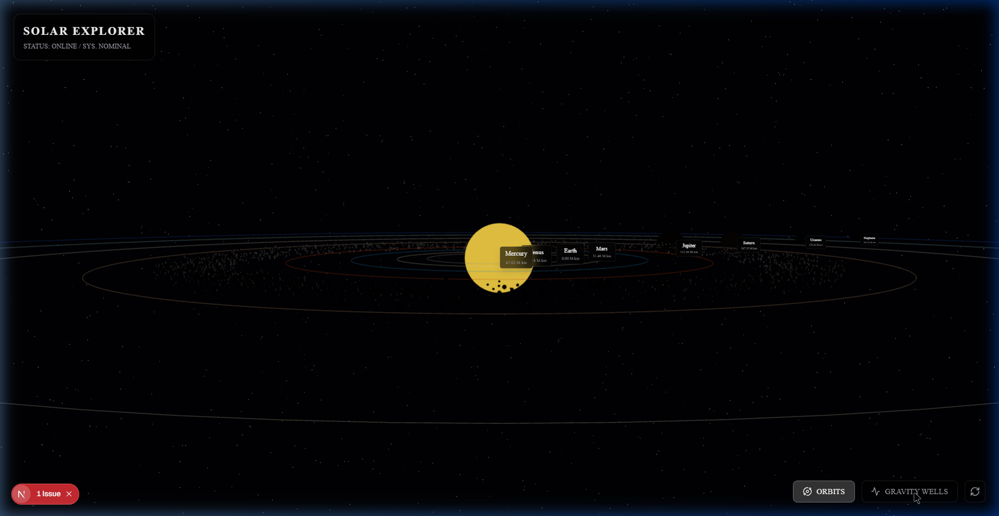
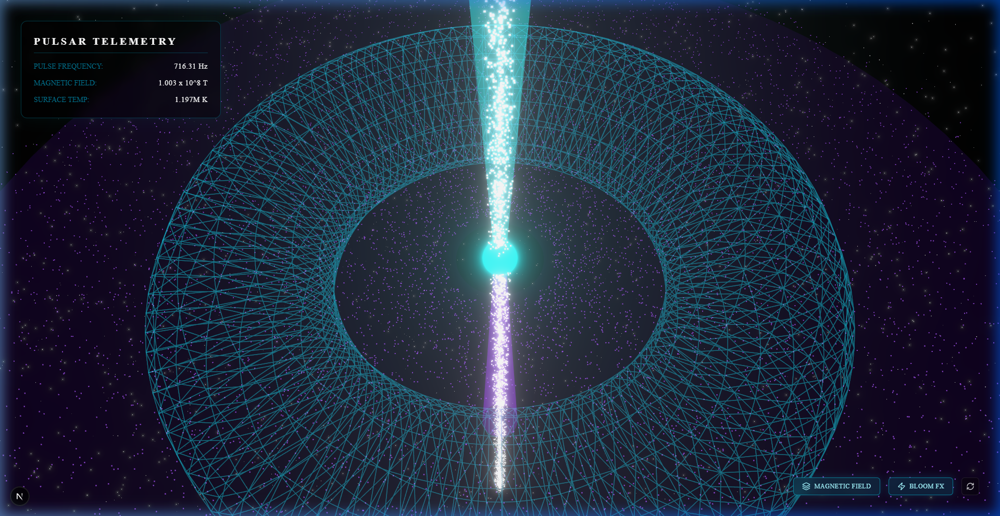

# Cinematic 3D Solar System Explorer 🪐

An immersive, high-fidelity WebGL visualization of our Solar System and astrophysical phenomena, built with a modern React 3D stack. This project aims to deliver a "Google Earth-style" cinematic experience in the browser, complete with realistic lighting, glowing celestial bodies, and dynamic telemetry tracking.

## 🚀 Tech Stack

- **Framework**: Next.js 15 (App Router)
- **Styling**: Tailwind CSS v4
- **3D Engine**: Three.js, React Three Fiber (R3F), and React Three Drei
- **State Management**: Zustand
- **VFX**: @react-three/postprocessing (Bloom effects, etc.)

## ✨ Features & Highlights

### 1. The Solar System (`/`)

- **Realistic Lighting & Void**: A deep procedural starfield background with an intense `PointLight` casting accurate shadows from the Sun.
- **Logarithmic Scaling**: A custom mathematical approach to rendering immense astrophysical distances interactively without losing the sense of scale.
- **Orbiting Planetary Bodies**: Automated mapping of the 8 major planets running live orbital simulations (`useFrame`).
- **Dynamic Asteroid Belt**: Performant instanced rendering (`InstancedMesh`) tracking 2,000 distinct geometries flying through space.
- **Interactive Telemetry HUD**: Floating glassmorphism UI overlay built with Tailwind, decoupled from the 3D loop for maximum performance. Clicking on any planet smoothly animates the camera down to its surface level.


### 2. Real-Time Gravity Wells

Toggle the "Gravity Wells" visualization to see a dynamic topological WebGL shader grid. The wireframe physically deforms downwards in real-time calculated against the immediate physical location and mass of celestial bodies over time.



### 3. The Pulsar Phenomenon (`/pulsar`)

A terrifyingly energetic astrophysics simulation of a rapidly rotating neutron star.

- **The Core**: A blindingly bright, highly emissive sphere rotating at over 300 RPM.
- **Relativistic Jets**: Opposing massive particle arrays simulating concentrated radiation emissions shooting out from the poles.
- **Accretion Disk**: 10,000 deep-purple particles locked in an independent, rapidly swirling orbit alongside a glowing cyan wireframe torus representing the magnetic field.
- **Telemetry Dashboard**: A fully functional dashboard utilizing a Space Mono aesthetic with live fluctuating data readouts for Pulse Frequency and Surface Temperature.



## 💻 Getting Started

First, run the development server:

```bash
npm install
npm run dev
```

Open [http://localhost:3000](http://localhost:3000) with your browser to explore the Solar System.
Navigate to [http://localhost:3000/pulsar](http://localhost:3000/pulsar) to view the Pulsar simulation.
